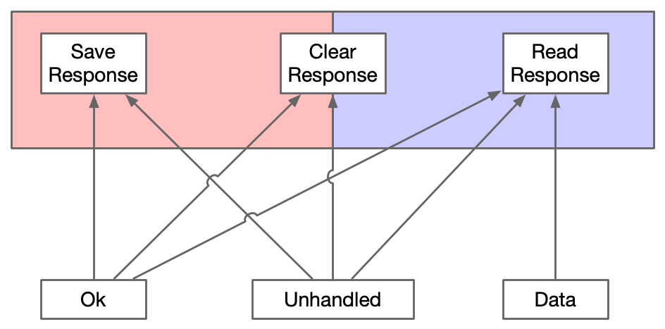

# Finite State Machines with Akka Typed Actors

## Introduction

This project uses akka-http server to expose two endpoints

```http request
POST http://localhost:8080/?data=<STRING>
``` 

This endpoint accepts a query parameter named `data` and stores it in memory

```http request
GET http://localhost:8080/
``` 

This endpoint returns previously stored string data

The way it's designed, you can alternatively send requests. i.e.
Once you post some data to the server, the server goes into `readonly` mode. In this
mode, you can only make a get request. If you attempt to post again, it will
return BAD REQUEST. Once you read the data, it will then again go into `writeonly` mode.

To achieve this functionality, akka-typed actors are used.

## Pattern

The pattern requires us to come up with a list of states.
Each state will have a corresponding akka `behavior`.


In addition the pattern requires that we create an ADT of messages for every
state of the state machine. Since we are using typed-actors,
we can then use `Behavior.receive[ADT]`.
This allows us to ensure that we handle all messages which are
applicable to state of machine. If any message is missed,
a compiler warning is generated. In order to prevent `ask pattern`
from timing out, when a message is not handled, we need to ensure
that every message has a `replyTo` address. That's why we have 
placed `replyTo` in the `Message` trait.


Finally, we need to create a similar set of ADTs for responses and
make sure that `Unhandled` response extends from all other response
ADTs because we need the ability to return `Unhandled` response
from all states.



## Motivation

Once achieved, this pattern will allow us to create Finite State Machines with akka typed actors with following design benefits:

1. The ask pattern will not time out if a message is not not handled by current behavior
1. This pattern makes it easy to look at message & response hierarchy and grok full high-level working of the state machine
without looking at logic
1. This pattern enforces handling of all messages required for a state. If a message is not handled,
compiler will generate warnings/errors