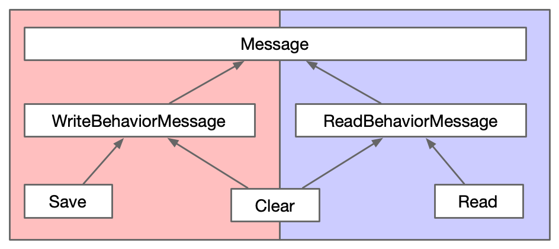

# Finite State Machines with Akka Typed Actors

## Introduction

This project uses akka-http server to expose two endpoints

```http request
POST http://localhost:8080/?data=<STRING>
``` 

This endpoint accepts a query parameter named `data` and stores it in memory

```http request
GET http://localhost:8080/
``` 

This endpoint returns previously stored string data

The way it's designed, you can alternatively send requests. i.e.
Once you post some data to the server, the server goes into `readonly` mode. In this
mode, you can only make a get request. If you attempt to post again, it will
return BAD REQUEST. Once you read the data, it will then again go into `writeonly` mode.

To achieve this functionality, akka-typed actors are used.

## Akka Actor Behaviors


Source: [Actors.scala](/src/main/scala/com/example/Actors.scala)

## Akka Input Messages



Source: [Message.scala](/src/main/scala/com/example/Message.scala)

## Akka Output Responses


Source: [Message.scala](/src/main/scala/com/example/Message.scala)

## Pattern

The pattern dictates that first come up with a list of states. Each state will have a corresponding akka `behavior`.
In order to ensure that ask pattern does not time out when a message is not handled, we need to ensure that a every message
has a `replyTo` address. In this case we have mandated this in the `Message` trait.

The pattern requires that we create an ADT per state/behavior. Since we are using typed-actors, we can then use `Behavior.receive[ADT]`.
This allows us to ensure that we handle all messages which are applicable to state of machine. If any message is missed, a compiler warning is generated.

Finally, we need to create a similar ADT for responses and make sure that `Unhandled` response extends from all other response ADS because we
need the ability to return `Unhandled` response from all states/behaviors.

# Motivation

Once (and **If**) achieved, this pattern will allow us to create Finite State Machines with akka typed actors with following design benefits:

1. The ask pattern will not time out if a message is not not handled by current behavior
1. This pattern makes it easy to look at message & response hierarchy and grok full high-level working of the state machine
without looking at logic
1. This pattern forces you to handle all messages required in for a state. If a message is not handled,
compiler will generate warnings/errors